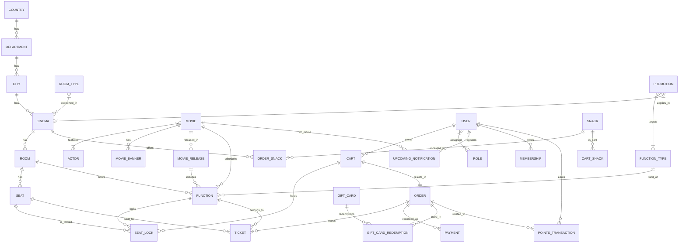

# ESTADO REAL DEL PROYECTO MULTICINE (backend)

Generado automáticamente a partir del código fuente actual en `app/src`.
Objetivo: documento de estado factual para pasar a otra IA (Claude) que generará
documentación de lógica de negocio para Analítica.

**Nota:** He escaneado los ficheros en `app/src` (models, controllers, services, repositories, routes, seeders). No se encontraron migraciones declarativas (migrations/), y no se dispone de la skill `graphify` en este entorno — incluyo relaciones extraídas de `models/associations.ts`.

**Resumen ejecutivo**

- **Estado general:** La mayoría del modelo de datos (tablas), repositorios y servicios CRUD/lectura para catálogo y catálogos (películas, ubicaciones, monedas, usuarios) están implementados; también existen seeders que crean datos de prueba (ubicaciones y cartelera). Sin embargo, los flujos transaccionales completos (checkout/pagos, endpoints de creación de órdenes, orquestación de pagos, APIs explícitas para bloqueo/liberación de asientos y procesamiento de pagos) no están implementados como servicios y controladores expuestos. No hay migraciones SQL versionadas en el repo. Estimo ~90% de las estructuras y catálogo implementados y ~50% de la lógica transaccional necesaria para producción (bloqueos/pagos) falta o está solo parcialmente representada en seeders/models.

**1) Arquitectura implementada (capas y ficheros clave)**

- **Entrypoint / arranque:** [app/src/index.ts](../index.ts#L1-L40) — levanta DB y `app`.
- **Servidor / middleware / swagger:** [app/src/server.ts](../server.ts#L1-L80) — monta rutas y Swagger UI (`/api/docs`).
- **Rutas (expuestas):** carpeta [app/src/routes](../routes) — `movies.routes.ts`, `notifications.routes.ts`, `user.routes.ts`, `locations.routes.ts`, `currency.routes.ts`, `auth.routes.ts`.
- **Controladores:** carpeta [app/src/controllers](../controllers) — implementados (ver siguiente sección).
- **Servicios:** carpeta [app/src/services](../services) — varios servicios implementados (movie, billboard, currency, locations, user, upcoming-notification, auth).
- **Repositorios (acceso a datos):** carpeta [app/src/repositories](../repositories) — `movie.repository.ts`, `user.repository.ts`, `currency.repository.ts`, `locations.repository.ts`, `upcoming-notification.repository.ts`, `billboard.repository.ts`.
- **Modelos / ORM:** carpeta [app/src/models](../models) — esquema relacional completo implementado en Sequelize (lista completa abajo).
- **Seeders:** [app/src/seeders/locations.seed.ts](../seeders/locations.seed.ts#L1-L40), [app/src/seeders/billboard.seed.ts](../seeders/billboard.seed.ts#L1-L40).

**2) Inventario real del código (implementado vs esqueleto)**

- Carpetas escaneadas: `models/`, `controllers/`, `services/`, `repositories/`, `routes/`, `seeders/`, `docs/`.
- Todos los controladores listados en `app/src/controllers` contienen implementación funcional (no son stubs): `auth`, `currency`, `locations`, `movies`, `notifications`, `user`.
- Servicios principales implementados: `movie.service.ts`, `billboard.service.ts`, `currency.service.ts`, `locations.service.ts`, `user.service.ts`, `upcoming-notification.service.ts`, `auth.service.ts`.
- Repositorios con lógica: `movie.repository.ts` (consultas complejas para funciones y recuentos), `user.repository.ts`, `currency.repository.ts`, `locations.repository.ts`, `upcoming-notification.repository.ts`, `billboard.repository.ts`.
- Interfaces (contracts) presentes en `services/interfaces` y `repositories/interfaces`.
- Módulos con esquemas y lógica en models: la carpeta `models/` contiene 45+ modelos con sus `init` y campos — no son plantillas.
- Componentes ausentes o incompletos:
    - No existen controladores y servicios dedicados a checkout/pagos/ordenes (no encontré `order.service.ts` ni `payment.service.ts` ni rutas `/api/orders`).
    - No hay endpoints públicos para bloquear/confirmar asientos (SeatLock tiene modelo y seed, pero no API para crearlo/confirmarlo).
    - No hay migraciones versionadas (no hay carpeta `migrations/`).

**3) Modelo de datos real (ERD resumido + tablas clave)**
Relaciones extraídas de [app/src/models/associations.ts](../models/associations.ts#L1-L40). Principales relaciones (resumen):

- Geography: Country -> Department -> City -> Cinema -> Room -> Seat
- Movies: Movie N:M Actor (movie_actors); Movie N:M Genre (movie_genres); Movie -> MovieBanner, MovieRelease, Movie -> Function(s)
- Booking: Function -> SeatLock -> Cart -> Order -> Ticket
- Orders: Cart -> Order; Order -> Payment(s), Order -> Ticket(s), Order -> OrderSnack(s), Order -> OrderPromotion(s)
- Promotions: Promotion N:M Cinema (promotion_cinemas); Promotion N:M FunctionType (promotion_function_types)
- Users: User N:M Role (user_roles); User -> ActivationToken; User -> RefreshToken; User -> Membership -> PointsTransaction
- Support: User -> Notification, UpcomingNotification

ERD (texto):

- `users (id)` 1---N `carts (user_id)` 1---1 `orders (cart_id)` 1---N `tickets (order_id)`
- `functions (id)` 1---N `seat_locks (function_id)` and 1---N `tickets (function_id)`
- `movies (id)` N---M `genres (via movie_genres)`

Tablas y campos (esquema resumido para tablas críticas — para todas las tablas ver los ficheros en `app/src/models`):

- **users** ([app/src/models/user.model.ts](../models/user.model.ts#L1-L40))
    - id: integer PK
    - country_id: integer FK
    - city_id: integer FK (nullable)
    - email: string(150) unique
    - password_hash: string
    - first_name, last_name, phone, birth_date (DATEONLY)
    - email_verified (bool), marketing_opt_in (bool)
    - status (string), failed_attempts (int), locked_until (date)
    - role (string) (nota: además existe tabla `roles` y `user_roles` para N:M)

- **movies** ([app/src/models/movie.model.ts](../models/movie.model.ts#L1-L40))
    - id, title, synopsis (TEXT), classification, duration_min (int), director, poster_url, trailer_url, status, rating (decimal)

- **functions** ([app/src/models/function.model.ts](../models/function.model.ts#L1-L40))
    - id, movie_id, room_id, function_type_id, starts_at (datetime), base_price (decimal), active (bool)

- **rooms** ([app/src/models/room.model.ts](../models/room.model.ts#L1-L40))
    - id, cinema_id, room_type_id, name, capacity, extra_price

- **seats** ([app/src/models/seat.model.ts](../models/seat.model.ts#L1-L40))
    - id, room_id, row, number, seat_type

- **seat_locks** ([app/src/models/seat-lock.model.ts](../models/seat-lock.model.ts#L1-L40))
    - id, cart_id, function_id, seat_id, expires_at (index unique on function_id+seat_id)

- **carts** ([app/src/models/cart.model.ts](../models/cart.model.ts#L1-L40))
    - id, user_id, status, expires_at, created_at

- **orders** ([app/src/models/order.model.ts](../models/order.model.ts#L1-L40))
    - id, user_id, cart_id, status, subtotal, discount, total, created_at

- **tickets** ([app/src/models/ticket.model.ts](../models/ticket.model.ts#L1-L40))
    - id, order_id, function_id, seat_id, holder_user_id, qr_code (unique), price, status, scanned_by_user_id, scanned_at

- **payments** ([app/src/models/payment.model.ts](../models/payment.model.ts#L1-L40))
    - id, order_id, method, amount, status, gateway_reference, idempotency_key (unique), paid_at

- **movie_releases** ([app/src/models/movie-release.model.ts](../models/movie-release.model.ts#L1-L40))
    - id, movie_id, country_id, release_date (unique per movie+country)

- **promotions, promotion_function_types, promotion_cinemas** — modelos disponibles con campos para vigencia, tipo, aplicabilidad.

Para ver la definición completa de cada tabla, consulte los archivos de modelos en `app/src/models/` (p. ej. [app/src/models/movie.model.ts](../models/movie.model.ts#L1-L40)).

**4) Módulos de negocio implementados: endpoints, reglas y gaps**

- **Movies / Billboard**
    - Rutas: [app/src/routes/movies.routes.ts](../routes/movies.routes.ts#L1-L40)
        - `GET /api/movies` → `getMovies()` → [app/src/controllers/movies.controller.ts](../controllers/movies.controller.ts#L1-L40) → `movieService.getAll()` → [app/src/services/movie.service.ts](../services/movie.service.ts#L1-L40) → `movie.repository.findAll()` ([app/src/repositories/movie.repository.ts](../repositories/movie.repository.ts#L1-L40)).
        - `GET /api/movies/weekly`, `/today`, `/filter`, `/upcoming`, `/upcoming/{id}`, `/:id`, `/:id/functions`, `/:id/recommendations` — implementados y documentados en Swagger. Reglas codificadas: validaciones de ID/params (ej. `parseRequiredId`), RN específicas: `findFutureFunctions` aplica RN-014 (solo funciones futuras) y marca `isSoldOut` si tickets >= room.capacity (lógica en `movie.service.ts` y `movie.repository.ts` con conteo de `tickets` y `seat_locks`).
    - Gaps: no hay endpoints para reservar/confirmar asientos ni crear `Cart`/`Order` desde cliente (solo seed/DB manipulación en seeders). No existe `checkout` ni `payment` flow.

- **Notifications (upcoming)**
    - Ruta: `POST /api/notifications/upcoming` ([app/src/routes/notifications.routes.ts](../routes/notifications.routes.ts#L1-L40)) → [app/src/controllers/notifications.controller.ts](../controllers/notifications.controller.ts#L1-L40) → `upcomingNotificationService.register()` ([app/src/services/upcoming-notification.service.ts](../services/upcoming-notification.service.ts#L1-L80)) → repository [app/src/repositories/upcoming-notification.repository.ts](../repositories/upcoming-notification.repository.ts#L1-L40).
    - Reglas codificadas: valida existencia de `user` y `movie`, valida que exista un `MovieRelease` futuro en el país del usuario y evita duplicados (devuelve `{ created: false, upcomingNotification }` si existe).

- **Users / Auth**
    - Rutas: `POST /api/auth/login` ([app/src/routes/auth.routes.ts](../routes/auth.routes.ts#L1-L40)) → [app/src/controllers/auth.controller.ts](../controllers/auth.controller.ts#L1-L80) → `AuthUser.login()` ([app/src/services/auth.service.ts](../services/auth.service.ts#L1-L40)) → genera JWT con `generateToken` y setea cookie `accesstoken`.
    - `POST /api/users` (registro), `POST /api/users/location` (usa `authMiddleware`) y endpoints de gestión (`GET /api/users`, `PATCH /api/users`, `DELETE /api/users`, `POST /api/users/restore`) están implementados en [app/src/routes/user.routes.ts](../routes/user.routes.ts). Reglas: `user.service.updateLocation()` valida que la ciudad tenga cines activos y que `userId` sea válido.
    - Gaps / notas: `roleMiddleware` existe ([app/src/middlewares/role.middleware.ts](../middlewares/role.middleware.ts)) pero no está aplicado en rutas administrativas (detecté que `role.middleware.ts` no es referenciado). Rutas administrativas recomendadas: gestión de usuarios y currencies.

- **Currency / Locations**
    - CRUD de `Currency` implementado con `currency.service.ts` y `currency.controller.ts` y rutas en [app/src/routes/currency.routes.ts](../routes/currency.routes.ts#L1-L40).
    - `Locations` (Country / Department / City / Cinema) tienen servicio y rutas. Seeders (`locations.seed.ts`) pre-pueblan monedas/países/ciudades/cines.

- **Promotions / Gift Cards / Memberships**
    - Modelos y tablas implementadas; no encontré endpoints REST públicos que expongan todas las operaciones (p. ej. crear/redeem gift card), excepto persistencia M/N en modelos y repositorios parciales.

**5) Flujos críticos (secuencia real según código)**

- **Consulta de cartelera y detalle de película** (funciona):
    1. Cliente solicita `/api/movies/weekly?cityId=X` (ruta en [movies.routes.ts](../routes/movies.routes.ts#L1-L40)).
    2. `movies.controller.getWeeklyBillboard` valida `cityId` y llama `billboardService.getBillboard()`.
    3. `billboard.repository` / `movie.repository` realizan consultas con joins (Movie, MovieRelease, Function, Room, Cinema, City). `movie.repository.findFutureFunctions` cuenta `Ticket` y `SeatLock` para determinar `isSoldOut`.

- **Registro de notificación de próximo estreno** (implementado):
    1. Cliente autenticado POST `/api/notifications/upcoming` con `{ movieId, cityId? }`.
    2. `notifications.controller.registerUpcomingNotification` valida token (cookie `accesstoken`) usando `authMiddleware` y llama `upcomingNotificationService.register(userId,movieId,cityId)`.
    3. Service valida usuario, película y existencia de `MovieRelease` futuro; evita duplicado y crea registro en `upcoming_notifications`.

- **Seeds que simulan compra y bloqueo parcial (no flujo API)**:
    - [app/src/seeders/billboard.seed.ts](../seeders/billboard.seed.ts#L1-L40) crea usuarios, carritos (`Cart` con status `SEED_BILLBOARD`), ordenes (`Order` con status `PAID`), tickets (SOLD) y un `SeatLock` para simular bloqueo y funciones sold out. Esto muestra el formato de datos que Analítica puede consumir, pero la lógica para alcanzarlo por API no existe.

**6) Datos persistidos / útiles para Analítica**

- Tablas con datos transaccionales y que el seed rellena:
    - `carts`, `orders` (seed crea `PAID`), `tickets` (SOLD), `seat_locks` (seed crea lock), `movie_releases`, `movies`, `rooms`, `seats`.
- Tablas de catálogo con seed: `currencies`, `countries`, `departments`, `cities`, `cinemas`, `room_types`, `function_types`, `genres`, `movies`, `movie_genres`.
- Tablas presentes pero sin data por defecto: `payments` (modelo existe pero no hay flow para crear pagos), `gift_cards` (modelo existe; no hay endpoints públicos para compra/redención).

**7) Gaps y riesgos técnicos detectados**

- Falta de migrations (no hay carpeta `migrations/`): riesgo para despliegues reproducibles en entornos (prod/staging).
- Falta de endpoints y servicios para checkout/pago/confirmación de ordenes. Aunque existen modelos (`Order`, `Payment`, `Ticket`), la orquestación no está implementada. Riesgo: imposible recibir pagos por API sin implementar servicios adicionales.
- `SeatLock` existe y se usa en conteos, pero no hay API para crear/renovar/liberar locks; esto dificulta la integración frontend para compra segura.
- `roleMiddleware` existe pero no aplicado: riesgo de endpoints administrativos sin protección de roles.
- Seeds crean datos de producción simulada (p. ej. `SEED_BILLBOARD`) — cuidado al ejecutar en entornos con datos reales.
- Ausencia de tests automatizados visibles para flujos críticos (no se detectaron tests de integración para compra/blocqueo/pago).

**8) Archivos clave (mapa rápido)**

- Server + Swagger: [app/src/server.ts](../server.ts#L1-L80) and [app/src/docs/swagger.ts](swagger.ts#L1-L40)
- Rutas: [app/src/routes](../routes)
- Controllers: [app/src/controllers](../controllers)
- Services: [app/src/services](../services)
- Repositories: [app/src/repositories](../repositories)
- Models: [app/src/models](../models) (lista completa al final)

**9) Lista completa de modelos (archivo por archivo)**

- Se detectaron y parsearon los siguientes modelos (cada archivo contiene definición de campos/índices, ver los ficheros):
    - [app/src/models/activation-token.model.ts](../models/activation-token.model.ts)
    - [app/src/models/actor.model.ts](../models/actor.model.ts)
    - [app/src/models/associations.ts](../models/associations.ts)
    - [app/src/models/audit-log.model.ts](../models/audit-log.model.ts)
    - [app/src/models/cart-snack.model.ts](../models/cart-snack.model.ts)
    - [app/src/models/cart.model.ts](../models/cart.model.ts)
    - [app/src/models/cineflash-activation.model.ts](../models/cineflash-activation.model.ts)
    - [app/src/models/cinema-room-type.model.ts](../models/cinema-room-type.model.ts)
    - [app/src/models/cinema-snack.model.ts](../models/cinema-snack.model.ts)
    - [app/src/models/cinema.model.ts](../models/cinema.model.ts)
    - [app/src/models/city.model.ts](../models/city.model.ts)
    - [app/src/models/country.model.ts](../models/country.model.ts)
    - [app/src/models/currency.model.ts](../models/currency.model.ts)
    - [app/src/models/department.model.ts](../models/department.model.ts)
    - [app/src/models/document-type.model.ts](../models/document-type.model.ts)
    - [app/src/models/function-type.model.ts](../models/function-type.model.ts)
    - [app/src/models/function.model.ts](../models/function.model.ts)
    - [app/src/models/genre.model.ts](../models/genre.model.ts)
    - [app/src/models/gift-card-redemption.model.ts](../models/gift-card-redemption.model.ts)
    - [app/src/models/gift-card.model.ts](../models/gift-card.model.ts)
    - [app/src/models/membership.model.ts](../models/membership.model.ts)
    - [app/src/models/movie-actor.model.ts](../models/movie-actor.model.ts)
    - [app/src/models/movie-banner.model.ts](../models/movie-banner.model.ts)
    - [app/src/models/movie-genre.model.ts](../models/movie-genre.model.ts)
    - [app/src/models/movie-release.model.ts](../models/movie-release.model.ts)
    - [app/src/models/movie.model.ts](../models/movie.model.ts)
    - [app/src/models/notification.model.ts](../models/notification.model.ts)
    - [app/src/models/order-promotion.model.ts](../models/order-promotion.model.ts)
    - [app/src/models/order-snack.model.ts](../models/order-snack.model.ts)
    - [app/src/models/order.model.ts](../models/order.model.ts)
    - [app/src/models/payment.model.ts](../models/payment.model.ts)
    - [app/src/models/points-transaction.model.ts](../models/point-transaction.model.ts)
    - [app/src/models/pqrs.model.ts](../models/pqrs.model.ts)
    - [app/src/models/promotion-cinema.model.ts](../models/promotion-cinema.model.ts)
    - [app/src/models/promotion-function-type.model.ts](../models/promotion-function-type.model.ts)
    - [app/src/models/promotion.model.ts](../models/promotion.model.ts)
    - [app/src/models/refresh-token.model.ts](../models/refresh-token.model.ts)
    - [app/src/models/role.model.ts](../models/role.model.ts)
    - [app/src/models/room-type.model.ts](../models/room_type.model.ts)
    - [app/src/models/room.model.ts](../models/room.model.ts)
    - [app/src/models/seat-lock.model.ts](../models/seat-lock.model.ts)
    - [app/src/models/seat.model.ts](../models/seat.model.ts)
    - [app/src/models/snack.model.ts](../models/snack.model.ts)
    - [app/src/models/survey.model.ts](../models/survey.model.ts)
    - [app/src/models/ticket-transfer.model.ts](../models/ticket-transfer.model.ts)
    - [app/src/models/ticket.model.ts](../models/ticket.model.ts)
    - [app/src/models/upcoming-notification.model.ts](../models/upcoming-notification.model.ts)
    - [app/src/models/user-document.model.ts](../models/user-document.model.ts)
    - [app/src/models/user-role.model.ts](../models/user-role.model.ts)
    - [app/src/models/user.model.ts](../models/user.model.ts)

**10) Recomendaciones inmediatas (prioritizadas)**

1. Implementar endpoints y servicios transaccionales mínimos: `cart` (crear/actualizar), `seat-lock` (lock/unlock), `checkout` (crear order), `payment` (orquestador) — esto habilita compras reales.
2. Añadir migrations versionadas (sequelize-cli migrations) antes de ejecutar seeds en entornos distintos.
3. Aplicar `roleMiddleware` en rutas administrativas (`currencies`, `users`, `locations`) y revisar `authMiddleware` para soporte de token en cabeceras además de cookie si es necesario.
4. Añadir tests de integración para flujo de compra (lock → order → payment → ticket).
5. Documentar contratos de eventos (si habrá webhooks de pasarela) y estados permitidos en `orders`, `payments`, `tickets`.

---

Si quieres, puedo:

- Generar un diagrama ERD en formato DOT/mermaid (texto) a partir de `associations.ts` para que Claude lo use. (no pude ejecutar `graphify` en este entorno)
- Añadir los endpoints y middleware de roles sugeridos como patchs (p. ej. proteger rutas administrativas con `roleMiddleware(["admin"])`).

Fin del reporte. Archivo generado desde análisis del código fuente en `app/src`.

**ERD (Mermaid)**

